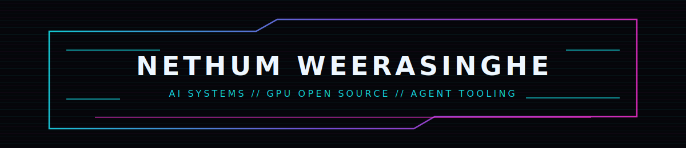

  

 

  
  &nbsp;&nbsp;&nbsp;
  

  <code>CS @ Texas A&amp;M</code> · <code>multi-agent AI tooling</code> · <code>NVIDIA open-source stack</code>

 

### `selected signal`

- `merged` [rapidsai/cudf #23032](https://github.com/rapidsai/cudf/pull/23032) · host buffers in `cudf.read_text`
- `merged` [NVIDIA/cccl #9680](https://github.com/NVIDIA/cccl/pull/9680) · cached `cuda.compute` builds for scalar closures
- `merged` [NVIDIA/boro #3](https://github.com/NVIDIA/boro/pull/3) · CRLF diff3 conflict separator handling
- `merged` [omnigent-ai/omnigent #1335](https://github.com/omnigent-ai/omnigent/pull/1335) · isolated per-tool schema builds
- `in review` [rapidsai/cudf #23099](https://github.com/rapidsai/cudf/pull/23099) · `inf` / `-inf` FLOAT32 scalar support
- `in review` [rapidsai/cuml #8317](https://github.com/rapidsai/cuml/pull/8317) · object dtype support in cuML compose flows

 

### `projects`

[`ShaiBot`](https://github.com/nethum529/ShaiBot) · agentic LLM trading system with a deterministic safety layer  
[`Seer`](https://github.com/nethum529/Seer) · native keyboard-first Linux / Wayland launcher  
[`perci`](https://github.com/nethum529/perci) · course-companion app for syllabi, assignments, and student dashboards

 

### `stack`

`Python` · `Rust` · `TypeScript` · `C++` · `CUDA` · `Linux/Wayland` · `multi-agent orchestration`

 

  <a href="https://github.com/nethum529?tab=repositories">repos</a>
  ·
  <a href="https://github.com/pulls?q=is%3Apr+author%3Anethum529">pulls</a>

